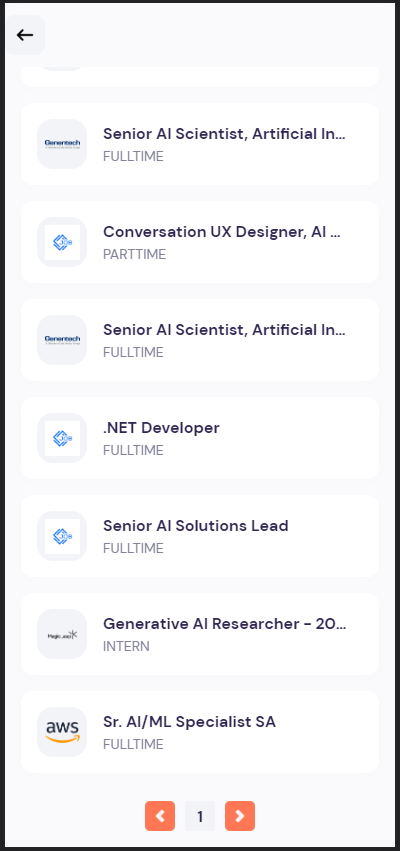

<h2><span style="font-size: 3em;">📱</span> App preview </h2>

<div style="display: flex; flex-direction: row; justify-content: center; align-items: center;">
  
  
  
  
   
   
</div>

## 💻 Running the App

To run the app, you will need to have Node.js and Expo CLI installed on your computer.
Clone this repository to your local machine using the following command:

```console
git clone https://github.com/nestornt/rn_jobs.git
```

Navigate to the project directory:

```console
cd rn_jobs
```

Install the dependencies:
```console
npm install
```

Start the Expo development server:

```console
expo start
```

Once the development server has started, you can launch the app on your device using the Expo app.

- Download the Expo app on your smartphone
- Open the Expo app and scan the QR code displayed in the terminal or browser
- Wait for the app to build and load on your device.
Note: Ensure your computer and phone are on the same Wi-Fi network for this step to work.

Alternatively, you can also launch the app in an iOS or Android simulator on your computer using the options provided by Expo CLI.

> :warning: **Important:** Please make sure to register in this API to obtain your personal key: https://rapidapi.com/letscrape-6bRBa3QguO5/api/jsearch, then replace the variable "API_KEY" in the code for your api key, otherwise you won´t find any results.
